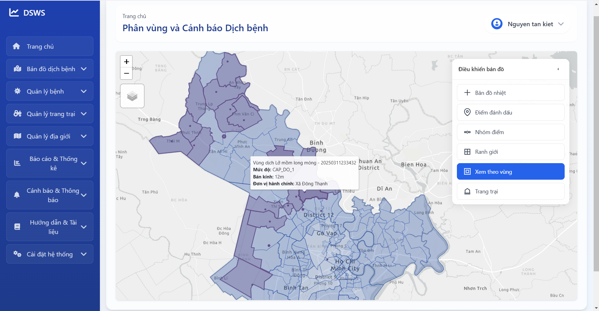
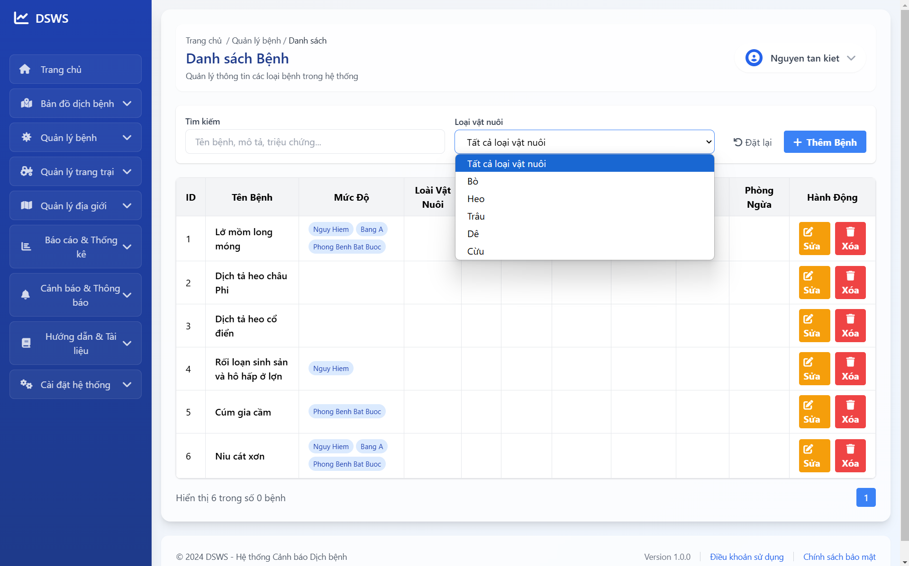
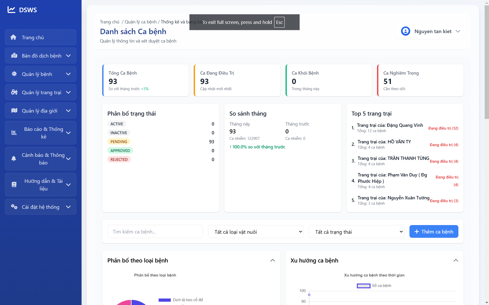
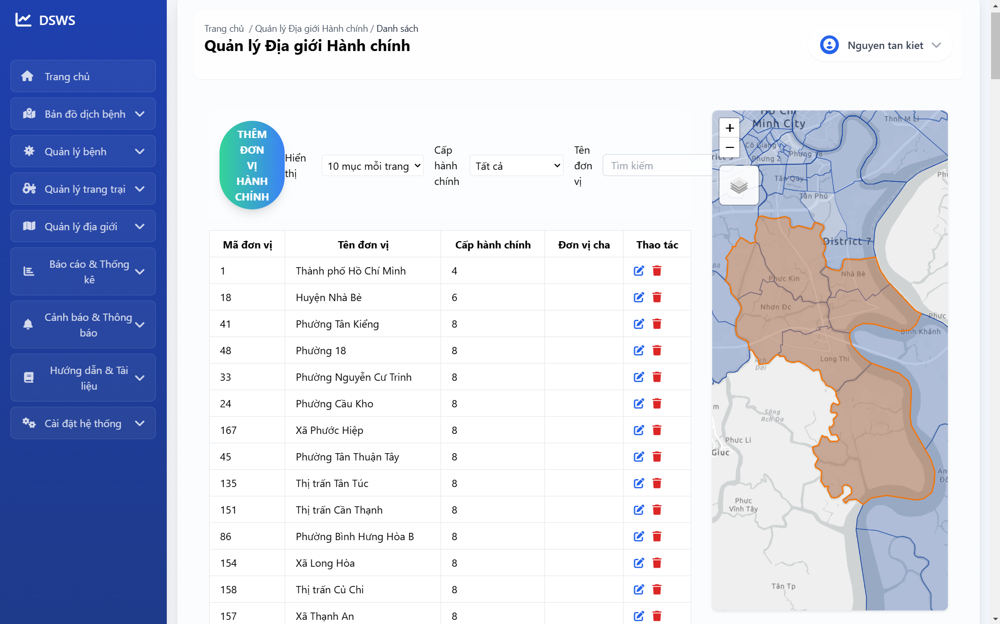
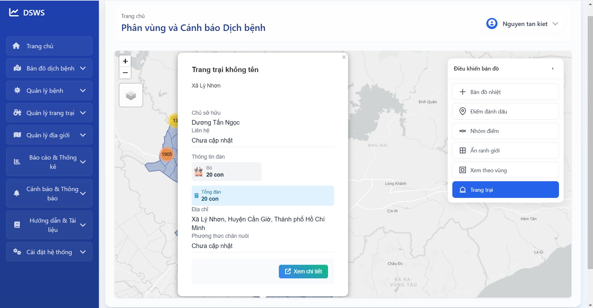
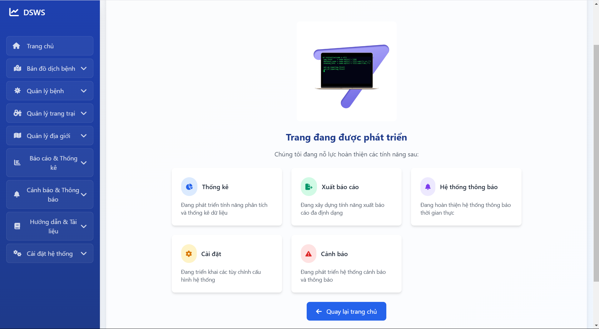
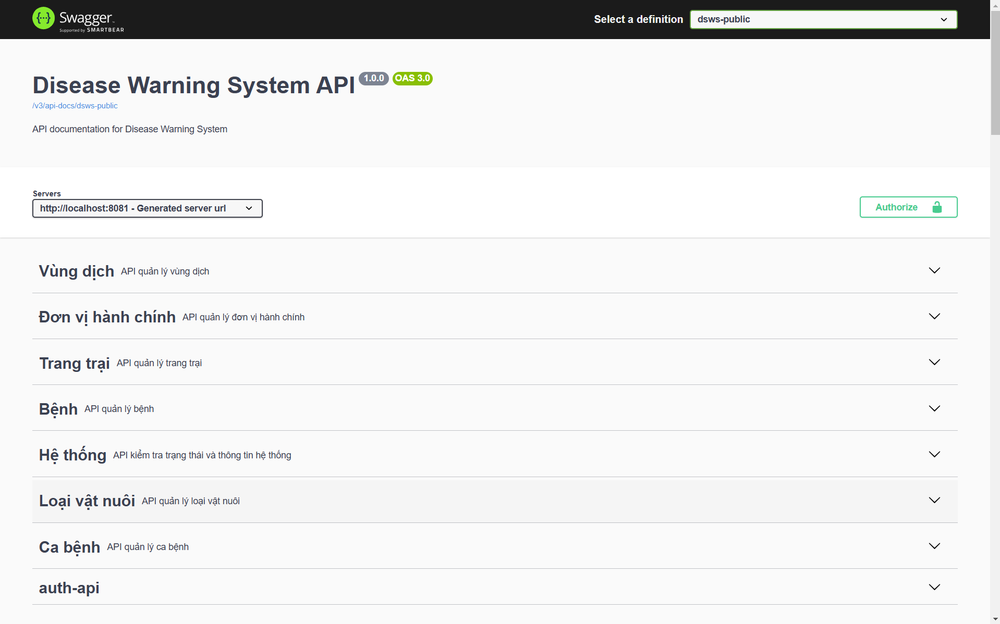

# Disease Surveillance and Warning System (DSWS)

## Giới thiệu

Dự án DSWS là một hệ thống giám sát và cảnh báo dịch bệnh, nhằm theo dõi, dự đoán và quản lý các đợt bùng phát dịch bệnh.
Hệ thống được xây dựng để hỗ trợ các cơ quan y tế trong việc phát hiện sớm và ứng phó hiệu quả với các tình huống dịch bệnh.
DSWS bao gồm cả giao diện người dùng và các API backend, cung cấp giải pháp toàn diện cho việc quản lý dịch bệnh.

## Tính năng chính

- Giám sát dữ liệu dịch bệnh theo thời gian thực
- Quản lý dữ liệu bệnh nhân và ca bệnh
- Quản lý thông tin các đơn vị hành chính
- Quản lý trang trại và cơ sở chăn nuôi
- Bản đồ trực quan hóa sự lây lan của dịch bệnh
- Phân vùng dịch bệnh theo địa lý

## Tính năng đang phát triển

- Dashboard phân tích dữ liệu nâng cao
- Hệ thống cảnh báo thông minh
- Phân tích xu hướng và dự đoán sự bùng phát dịch bệnh
- Báo cáo và phân tích thống kê chi tiết
- Mô hình dự báo dựa trên AI/ML

## Công nghệ sử dụng

### Backend

- Java 21
- Spring Boot
- PostgreSQL 16
- Hibernate ORM
- Flyway (database migrations)
- RESTful API
- JWT Authentication
- Thymeleaf templates

### Frontend

- Thymeleaf + JavaScript
- Leaflet (bản đồ)
- Chart.js (biểu đồ)
- Bootstrap CSS framework

## Kiến trúc hệ thống

Hệ thống DSWS được xây dựng theo kiến trúc MVC (Model-View-Controller) với các thành phần chính:

### Domain Layer

- Models: Đại diện cho các thực thể chính trong hệ thống (bệnh, ca bệnh, đơn vị hành chính...)
- Repositories: Truy xuất dữ liệu từ cơ sở dữ liệu
- Services: Xử lý logic nghiệp vụ chính

### Presentation Layer

- Controllers: Xử lý các request từ người dùng, gọi services thích hợp và trả về responses
- Views: Templates Thymeleaf để hiển thị giao diện người dùng

### Cross-cutting concerns

- Security: Xác thực và phân quyền người dùng
- Exception handling: Xử lý các exception một cách nhất quán
- Data importers: Import dữ liệu từ các nguồn khác nhau vào hệ thống

## Cài đặt và chạy dự án

### Yêu cầu hệ thống

- Java 21
- Maven 3.6+
- PostgreSQL 16

### Backend

```bash
# Clone repository
https://github.com/tankietse/dsws-backend.git
# Di chuyển vào thư mục project
cd dsws

# Cài đặt dependencies
mvn clean install

# Chạy ứng dụng
mvn spring-boot:run
```

## Trạng thái phát triển

- **Đã hoàn thành**: Quản lý bệnh, Quản lý ca bệnh, Quản lý đơn vị hành chính, Quản lý trang trại, Bản đồ phân vùng dịch bệnh cơ bản
- **Đang phát triển**: Dashboard phân tích, Hệ thống cảnh báo, Dự báo xu hướng
- **Kế hoạch tương lai**: Tích hợp AI/ML, Mở rộng API cho bên thứ ba

## Giao diện người dùng

### Đăng nhập hệ thống


*Giao diện xác thực người dùng để truy cập hệ thống*

### Dashboard chính


*Dashboard hiển thị tổng quan về tình hình dịch bệnh*

### Quản lý bệnh


*Giao diện quản lý thông tin và phân loại các loại bệnh*

### Quản lý ca bệnh


*Giao diện theo dõi và quản lý các ca bệnh được ghi nhận*

### Quản lý đơn vị hành chính


*Giao diện quản lý thông tin các đơn vị hành chính*

### Quản lý trang trại


*Giao diện quản lý thông tin các trang trại và cơ sở chăn nuôi*

### Bản đồ dịch bệnh


*Bản đồ trực quan hiển thị sự phân bố địa lý của các ca bệnh*

### Biểu đồ phân tích (Đang phát triển)


*Các biểu đồ thống kê và phân tích xu hướng dịch bệnh - Đang trong quá trình phát triển*

### Quản lý cảnh báo (Đang phát triển)


*Giao diện quản lý và cấu hình các cảnh báo - Đang trong quá trình phát triển*

### API Documentation


*Tài liệu API được hiển thị qua Swagger UI*

## Cấu trúc dự án

dsws/
├── src/
│   ├── main/
│   │   ├── java/com/webgis/dsws/
│   │   │   ├── config/           # Cấu hình ứng dụng
│   │   │   ├── controller/       # Controllers (API và View)
│   │   │   ├── domain/           # Domain models, DTOs, repositories, services
│   │   │   ├── exception/        # Exception handling
│   │   │   ├── importer/         # Data importers
│   │   │   ├── mapper/           # Object mappers
│   │   │   ├── security/         # Security configuration
│   │   │   └── util/             # Utility classes
│   │   ├── resources/
│   │   │   ├── static/           # Static resources (JS, CSS, images)
│   │   │   ├── templates/        # Thymeleaf templates
│   │   │   ├── db/migration/     # Flyway migration scripts
│   │   │   └── application.properties # Cấu hình ứng dụng
│   └── test/                     # Unit tests
├── data/                         # Data files
└── UI/                           # UI screenshots
