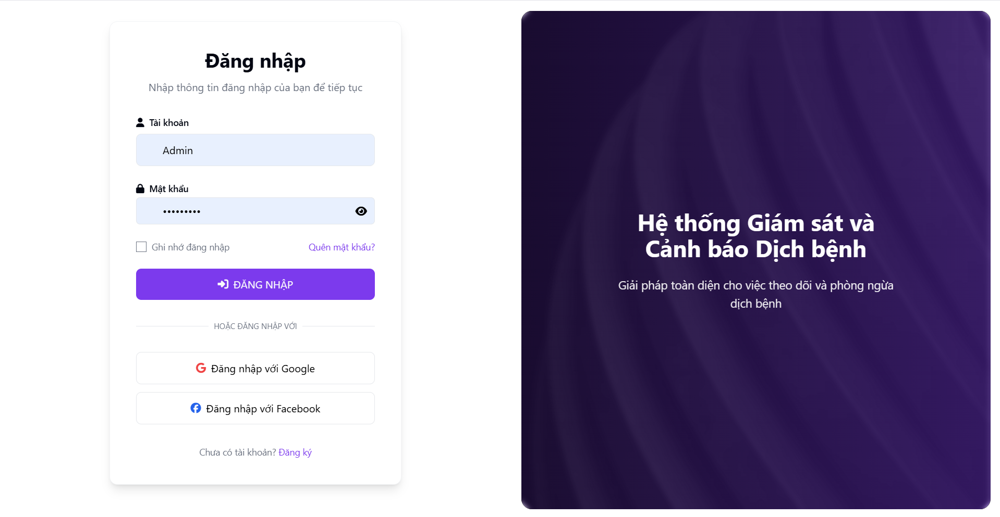

# Disease Surveillance and Warning System (DSWS)

## Giới thiệu

Dự án DSWS là một hệ thống giám sát và cảnh báo dịch bệnh, nhằm theo dõi, dự đoán và quản lý các đợt bùng phát dịch bệnh.
Hệ thống được xây dựng để hỗ trợ các cơ quan y tế trong việc phát hiện sớm và ứng phó hiệu quả với các tình huống dịch bệnh.
DSWS bao gồm cả giao diện người dùng và các API backend, cung cấp giải pháp toàn diện cho việc quản lý dịch bệnh.

## Tính năng chính

- Giám sát dữ liệu dịch bệnh theo thời gian thực
- Quản lý dữ liệu bệnh nhân và ca bệnh
- Quản lý thông tin các đơn vị hành chính
- Quản lý trang trại và cơ sở chăn nuôi
- Bản đồ trực quan hóa sự lây lan của dịch bệnh
- Phân vùng dịch bệnh theo địa lý

## Tính năng đang phát triển

- Dashboard phân tích dữ liệu nâng cao
- Hệ thống cảnh báo thông minh
- Phân tích xu hướng và dự đoán sự bùng phát dịch bệnh
- Báo cáo và phân tích thống kê chi tiết
- Mô hình dự báo dựa trên AI/ML

## Công nghệ sử dụng

### Backend

- Java 21
- Spring Boot
- PostgreSQL 16
- Hibernate ORM
- Flyway (database migrations)
- RESTful API
- JWT Authentication
- Thymeleaf templates

### Frontend

- Thymeleaf + JavaScript
- Leaflet (bản đồ)
- Chart.js (biểu đồ)
- Bootstrap CSS framework

## Kiến trúc hệ thống

Hệ thống DSWS được xây dựng theo mô hình kiến trúc phân lớp (Layered Architecture) kết hợp với mẫu MVC (Model-View-Controller), tạo nên một hệ thống có tính mô-đun cao, dễ bảo trì và mở rộng.


*Sơ đồ kiến trúc tổng thể của hệ thống DSWS*

### Mô hình kiến trúc tổng thể

- **Kiến trúc phân lớp**: Hệ thống được chia thành các lớp riêng biệt với trách nhiệm cụ thể, giúp giảm sự phụ thuộc và tăng khả năng tái sử dụng code
- **Mẫu MVC**: Tách biệt logic nghiệp vụ (Model), giao diện người dùng (View) và xử lý request (Controller)
- **RESTful API**: Cung cấp giao diện giao tiếp chuẩn cho các ứng dụng bên ngoài

### Các lớp chính trong hệ thống

#### 1. Presentation Layer (Lớp trình bày)

- **Web Controllers**: Xử lý các HTTP request, điều hướng và hiển thị view
  - Phân chia thành 2 loại controller chính:
    - **View Controllers**: Xử lý các request từ giao diện người dùng web
    - **API Controllers**: Cung cấp RESTful API endpoints
  - Các controller chính:
    - `AuthApi`: Xác thực và phân quyền người dùng
    - `BenhApi`: Quản lý thông tin bệnh
    - `CaBenhApi`: Quản lý ca bệnh
    - `DonViHanhChinhApi`: Quản lý đơn vị hành chính
    - `LoaiVatNuoiApi`: Quản lý loại vật nuôi
    - `TrangTraiApi`: Quản lý trang trại
    - `VungDichApi`: Quản lý vùng dịch

- **Views**: Giao diện người dùng
  - Templates Thymeleaf
  - Tích hợp JavaScript, Bootstrap và các thư viện frontend
  - Các component tương tác (bản đồ, biểu đồ, form)

#### 2. Domain Layer (Lớp miền)

- **Models**: Đại diện cho các thực thể chính trong hệ thống
  - `Benh`: Thông tin về bệnh
  - `CaBenh`: Thông tin ca bệnh
  - `DienBienCaBenh`: Diễn biến của ca bệnh theo thời gian
  - `DonViHanhChinh`: Đơn vị hành chính
  - `TrangTrai`: Thông tin trang trại
  - `LoaiVatNuoi`: Loại vật nuôi
  - `NguoiDung`: Người dùng hệ thống
  - `VungDich`: Vùng dịch
  - `CanhBao`: Cảnh báo dịch bệnh
  - Các enum và constants định nghĩa các giá trị cố định

- **Repositories**: Truy xuất dữ liệu từ cơ sở dữ liệu
  - Sử dụng Spring Data JPA
  - Các repository tương ứng với các model

- **Services**: Xử lý logic nghiệp vụ chính
  - `BenhService`: Quản lý thông tin bệnh
  - `CaBenhService`: Quản lý ca bệnh
  - `DienBienCaBenhService`: Quản lý diễn biến ca bệnh
  - `DonViHanhChinhService`: Quản lý đơn vị hành chính
  - `TrangTraiService`: Quản lý trang trại
  - `LoaiVatNuoiService`: Quản lý loại vật nuôi
  - `NguoiDungService`: Quản lý người dùng
  - `VungDichService`: Quản lý vùng dịch
  - `ClusterAnalysisService`: Phân tích cụm dịch bệnh
  - `GeometryService`: Xử lý dữ liệu không gian địa lý
  - `VungDichAutoImportService`: Tự động import dữ liệu vùng dịch

- **DTOs (Data Transfer Objects)**: Đối tượng trung gian để truyền dữ liệu giữa các lớp
  - Các DTO tương ứng với các model

- **Mappers**: Chuyển đổi giữa domain models và DTOs

#### 3. Infrastructure Layer (Lớp hạ tầng)

- **Config**: Cấu hình ứng dụng
  - Cấu hình Spring Security
  - Cấu hình Database
  - Cấu hình Web

- **Security**: Xác thực và phân quyền
  - JWT Authentication
  - Role-based Access Control

- **Exception**: Xử lý ngoại lệ
  - Global Exception Handler
  - Custom exceptions

- **Util**: Các tiện ích
  - Xử lý file
  - Xử lý date/time
  - Xử lý chuỗi

- **Importer**: Import dữ liệu
  - Import dữ liệu từ file Excel, CSV
  - Import dữ liệu địa lý

### Luồng dữ liệu trong hệ thống

1. **Luồng xử lý request**:
   - HTTP Request → Controller → Service → Repository → Database
   - Database → Repository → Service → Controller → HTTP Response

2. **Luồng quản lý ca bệnh**:
   - Nhập thông tin ca bệnh → Xác thực dữ liệu → Lưu vào database
   - Cập nhật diễn biến ca bệnh → Phân tích → Cập nhật vùng dịch

3. **Luồng phân tích không gian**:
   - Dữ liệu ca bệnh → Phân tích cụm → Xác định vùng dịch → Hiển thị trên bản đồ

4. **Luồng cảnh báo**:
   - Phân tích dữ liệu → Phát hiện nguy cơ → Tạo cảnh báo → Gửi thông báo

### Các công nghệ và thư viện chính

- **Backend**:
  - Spring Boot: Framework phát triển ứng dụng
  - Spring Security: Bảo mật và xác thực
  - Spring Data JPA: Truy cập dữ liệu
  - Hibernate: ORM (Object-Relational Mapping)
  - PostgreSQL + PostGIS: Cơ sở dữ liệu và xử lý dữ liệu không gian
  - Flyway: Quản lý migration database

- **Frontend**:
  - Thymeleaf: Template engine
  - Bootstrap: Framework CSS
  - jQuery: Thư viện JavaScript
  - Leaflet: Thư viện bản đồ
  - Chart.js: Thư viện biểu đồ

### Các mẫu thiết kế (Design Patterns) sử dụng

- **Repository Pattern**: Trừu tượng hóa việc truy cập dữ liệu
- **Service Layer Pattern**: Đóng gói logic nghiệp vụ
- **DTO Pattern**: Truyền dữ liệu giữa các lớp
- **MVC Pattern**: Tách biệt logic nghiệp vụ, giao diện người dùng và xử lý request
- **Dependency Injection**: Giảm sự phụ thuộc giữa các thành phần

## Cài đặt và chạy dự án

### Yêu cầu hệ thống

- Java 21
- Maven 3.6+
- PostgreSQL 16

### Backend

```bash
# Clone repository
https://github.com/tankietse/dsws-backend.git
# Di chuyển vào thư mục project
cd dsws

# Cài đặt dependencies
mvn clean install

# Chạy ứng dụng
mvn spring-boot:run
```

## Trạng thái phát triển

- **Đã hoàn thành**: Quản lý bệnh, Quản lý ca bệnh, Quản lý đơn vị hành chính, Quản lý trang trại, Bản đồ phân vùng dịch bệnh cơ bản
- **Đang phát triển**: Dashboard phân tích, Hệ thống cảnh báo, Dự báo xu hướng
- **Kế hoạch tương lai**: Tích hợp AI/ML, Mở rộng API cho bên thứ ba

## Giao diện người dùng

### Đăng nhập hệ thống


*Giao diện xác thực người dùng để truy cập hệ thống*

### Dashboard chính


*Dashboard hiển thị tổng quan về tình hình dịch bệnh*

### Quản lý bệnh


*Giao diện quản lý thông tin và phân loại các loại bệnh*

### Quản lý ca bệnh


*Giao diện theo dõi và quản lý các ca bệnh được ghi nhận*


*Giao diện thêm ca bệnh mới*

### Quản lý đơn vị hành chính


*Giao diện quản lý thông tin các đơn vị hành chính*

### Quản lý trang trại


*Giao diện quản lý thông tin các trang trại và cơ sở chăn nuôi*

### Bản đồ dịch bệnh


*Bản đồ trực quan hiển thị sự phân bố địa lý của các ca bệnh*

### Biểu đồ phân tích (Đang phát triển)


*Các biểu đồ thống kê và phân tích xu hướng dịch bệnh - Đang trong quá trình phát triển*

### Quản lý cảnh báo (Đang phát triển)


*Giao diện quản lý và cấu hình các cảnh báo - Đang trong quá trình phát triển*

### API Documentation


*Tài liệu API được hiển thị qua Swagger UI*

## Cấu trúc dự án
```
dsws/
├── src/
│   ├── main/
│   │   ├── java/com/webgis/dsws/
│   │   │   ├── config/           # Cấu hình ứng dụng
│   │   │   ├── controller/       # Controllers (API và View)
│   │   │   ├── domain/           # Domain models, DTOs, repositories, services
│   │   │   ├── exception/        # Exception handling
│   │   │   ├── importer/         # Data importers
│   │   │   ├── mapper/           # Object mappers
│   │   │   ├── security/         # Security configuration
│   │   │   └── util/             # Utility classes
│   │   ├── resources/
│   │   │   ├── static/           # Static resources (JS, CSS, images)
│   │   │   ├── templates/        # Thymeleaf templates
│   │   │   ├── db/migration/     # Flyway migration scripts
│   │   │   └── application.properties # Cấu hình ứng dụng
│   └── test/                     # Unit tests
├── data/                         # Data files
└── UI/                           # UI screenshots
```
